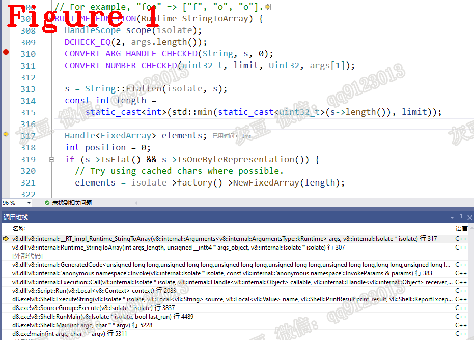

# 《Chrome V8 源码》44. Runtime_StringToArray 源码、触发条件  
   
# 1 介绍 
Runtime 是一系列采用 C++ 语言编写的功能方法，它实现了大量 JavaScript 运行期间需要的 native 功能。接下来几篇文章将介绍一些 Runtime 方法。本文分析 Runtime_StringToArray 方法的源码和重要数据结构，讲解 Runtime_StringToArray 方法的触发条件。  
**注意：** Runtime 方法的加载、调用以及 RUNTIME_FUNCTION 宏模板请参见第十六篇文章。--allow-natives-syntax 和 %-prefix 不是本文的讲解重点。  
# 2 StringToArray 测试用例  
字符串转数组（StringToArray）主要应用在 String.prototype.split 源码中，StringToArray 功能的实现有两个，一个是 StringBuiltinsAssembler::StringToArray()（参见第 39 篇文章），另一个是 Runtime_StringToArray()。字符串转数组时，先使用 StringBuiltinsAssembler::StringToArray() 功能，当该功能 **不适合** 时转而采用效率较低的 Runtime_StringToArray() 功能。下面从 split 源码说起：  
```c++
1.  TF_BUILTIN(StringPrototypeSplit, StringBuiltinsAssembler) {
2.    // If the separator string is empty then return the elements in the subject.
3.    {//.............省略.....................
4.      Label next(this);
5.      GotoIfNot(SmiEqual(LoadStringLengthAsSmi(separator_string), smi_zero),
6.                &next);
7.      TNode<Smi> subject_length = LoadStringLengthAsSmi(subject_string);
8.      GotoIf(SmiEqual(subject_length, smi_zero), &return_empty_array);
9.      args.PopAndReturn(
10.          StringToArray(context, subject_string, subject_length, limit_number));
11.      BIND(&next);
12.    }//.............省略.....................
13.  }
```  
上述代码中，第 5 行代码检测 separator_string 的长度不为零时，跳转到 11 行；
第 7-8 行代码判断字符串是否为空，如果为空则返回空数组；  
**得到结论：** 第 9 行代码生成并返回由字符组成的数组，也就是 string.split("") 的结果。  
下面给出 StringBuiltinsAssembler::StringToArray() 源码：  
```c++
1.  TNode<JSArray> StringBuiltinsAssembler::StringToArray(
2.      TNode<NativeContext> context, TNode<String> subject_string,
3.      TNode<Smi> subject_length, TNode<Number> limit_number) {
4.  //省略..................
5.    to_direct.TryToDirect(&call_runtime);
6.    BIND(&call_runtime);
7.    {
8.      result_array = CAST(CallRuntime(Runtime::kStringToArray, context,
9.                                      subject_string, limit_number));
10.      Goto(&done);
11.    }
12.    BIND(&done);
13.    return result_array.value();
14.  }
```   
上述代码的详细功能参见第 39 篇文章，第 5 行代码转换失败时则跳转到第 8 行代码（Runtime_StringToArray），也就符合了前面提到的 “不适合” 条件。  
TryToDirect 功能参见之前的文章，下面给出最终的测试用例:  
```c++
var str1="chromium";
var str2="blink";
var str3 = "Understanding"
var cons= str1+str2+str3.substring(3);
console.log(cons.split(""));
```   
上述代码中， cons 变量中包括了 “str1 + str2” 的结果，该结果的类型是 ConsString，也包括了 str3 的子部分，所以会导致 TryToDirect 失败。  
# 3 Runtime_StringToArray 源码  
源码如下：  
```c++
1.  RUNTIME_FUNCTION(Runtime_StringToArray) {
2.    HandleScope scope(isolate);
3.    DCHECK_EQ(2, args.length());
4.    CONVERT_ARG_HANDLE_CHECKED(String, s, 0);
5.    CONVERT_NUMBER_CHECKED(uint32_t, limit, Uint32, args[1]);
6.    s = String::Flatten(isolate, s);
7.    const int length =
8.        static_cast<int>(std::min(static_cast<uint32_t>(s->length()), limit));
9.    Handle<FixedArray> elements;
10.    int position = 0;
11.    if (s->IsFlat() && s->IsOneByteRepresentation()) {
12.      elements = isolate->factory()->NewFixedArray(length);
13.      DisallowGarbageCollection no_gc;
14.      String::FlatContent content = s->GetFlatContent(no_gc);
15.      if (content.IsOneByte()) {
16.        base::Vector<const uint8_t> chars = content.ToOneByteVector();
17.        position = CopyCachedOneByteCharsToArray(isolate->heap(), chars.begin(),
18.                                                 *elements, length);
19.      } else {
20.        MemsetTagged(elements->data_start(),
21.                     ReadOnlyRoots(isolate).undefined_value(), length);
22.      }
23.    } else {
24.      elements = isolate->factory()->NewFixedArray(length);
25.    }
26.    for (int i = position; i < length; ++i) {
27.      Handle<Object> str =
28.          isolate->factory()->LookupSingleCharacterStringFromCode(s->Get(i));
29.      elements->set(i, *str);
30.    }
31.  #ifdef DEBUG
32.    for (int i = 0; i < length; ++i) {
33.      DCHECK_EQ(String::cast(elements->get(i)).length(), 1);
34.    }
35.  #endif
36.    return *isolate->factory()->NewJSArrayWithElements(elements);
37.  }
```   
上述代码中，第 6 行代码执行字符串 Flatten；  
第 7 行获得字符串长度 length，并做最大长度限制检测 limit；   
第 11 行检测字符串是否为 OneByte 类型；  
第 12 行申请长度为 length 的 Array 数组 elements；  
第 14 行获得 FlatContent 内存；   
第 16~17 行把 FlatContent 内容以字符为粒度逐个拷贝到 elements 数组中；  
第 20~24 行创建 Array 数组 elements；    
第 26~29 行从 Cache 中查找相应的字符并填充进 elements；    
第 36 行使用 elements 创建 JSArray 并返回结果。  
下面说明 Runtime_StringToArray 中使用的重要函数：  
**（1）** LookupSingleCharacterStringFromCode，V8 内部字符串缓存功能  
```c++
1.  Handle<String> Factory::LookupSingleCharacterStringFromCode(uint16_t code) {
2.    if (code <= unibrow::Latin1::kMaxChar) {
3.      {
4.        Object value = single_character_string_cache()->get(code);
5.      }
6.      Handle<String> result =
7.          InternalizeString(base::Vector<const uint8_t>(buffer, 1));
8.      single_character_string_cache()->set(code, *result);
9.      return result;
10.    }
11.    uint16_t buffer[] = {code};
12.    return InternalizeString(base::Vector<const uint16_t>(buffer, 1));
13.  }
```  
V8 使用 string cache 保存常用的、可以复用的字符，这些字符的类型是内部字符。上述代码中，第 2-4 行代码使用 int16 类数值 code 在 ASCII 范围内查找 cache；
第 6 行申请新的内部字符串，并保存到 string cache 中；
第 11~12 行申请新的内部字符串，这些字符串超了 ASCII 范围，重复使用的概率很小，所以不缓存 string cache。  
**（2）** InternalizeString，内部字符串生成函数  
```c++
1.  template <typename Impl>
2.  Handle<String> FactoryBase<Impl>::InternalizeString(
3.      const base::Vector<const uint8_t>& string, bool convert_encoding) {
4.    SequentialStringKey<uint8_t> key(string, HashSeed(read_only_roots()),
5.                                     convert_encoding);
6.    return InternalizeStringWithKey(&key);
7.  }
8.  template <typename Impl>
9.  Handle<String> FactoryBase<Impl>::InternalizeString(
10.      const base::Vector<const uint16_t>& string, bool convert_encoding) {
11.    SequentialStringKey<uint16_t> key(string, HashSeed(read_only_roots()),
12.                                      convert_encoding);
13.    return InternalizeStringWithKey(&key);
14.  }
```   
上述代码从 int8 和 int16 两个方面分别实现 InternalizeString()，核心功能由 InternalizeStringWithKey() 实现。
Runtime_StringToArray 方法的最后一行代码将 elements 包装成 NewJSArrayWithElements 数组并返回结果。  
**（3）** NewJSArrayWithElements，JSArray生成函数  
源码如下： 
```c++
1.  Handle<JSArray> Factory::NewJSArrayWithUnverifiedElements(
2.      Handle<FixedArrayBase> elements, ElementsKind elements_kind, int length,
3.      AllocationType allocation) {
4.    DCHECK(length <= elements->length());
5.    NativeContext native_context = isolate()->raw_native_context();
6.    Map map = native_context.GetInitialJSArrayMap(elements_kind);
7.    if (map.is_null()) {
8.      JSFunction array_function = native_context.array_function();
9.      map = array_function.initial_map();
10.    }
11.    Handle<JSArray> array = Handle<JSArray>::cast(
12.        NewJSObjectFromMap(handle(map, isolate()), allocation));
13.    DisallowGarbageCollection no_gc;
14.    JSArray raw = *array;
15.    raw.set_elements(*elements);
16.    raw.set_length(Smi::FromInt(length));
17.    return array;
18.  }
```   
上述代码中，第 2 行 elements 是之前申请的字符串数组；elements_kind 采用默认的 TERMINAL_FAST_ELEMENTS_KIND；  
第 6 行根据 elements_kind 获取初始 map；  
第 8~9 行 map 为空时采用 array_function 初始化 map；  
第 11 行创建 JSArray 数组对象 array；   
第 15~16 行把 elements 和 length 保存到 array 中。    
**（4）** NewJSObjectFromMap，申请JSArray内存空间   
```c++
1.  Handle<JSObject> Factory::NewJSObjectFromMap(
2.      Handle<Map> map, AllocationType allocation,
3.      Handle<AllocationSite> allocation_site) {
4.    // JSFunctions should be allocated using AllocateFunction to be
5.    // properly initialized.
6.    DCHECK(!InstanceTypeChecker::IsJSFunction((map->instance_type())));
7.    // Both types of global objects should be allocated using
8.    // AllocateGlobalObject to be properly initialized.
9.    DCHECK(map->instance_type() != JS_GLOBAL_OBJECT_TYPE);
10.    JSObject js_obj = JSObject::cast(
11.        AllocateRawWithAllocationSite(map, allocation, allocation_site));
12.    InitializeJSObjectFromMap(js_obj, *empty_fixed_array(), *map);
13.    DCHECK(js_obj.HasFastElements() || js_obj.HasTypedArrayElements() ||
14.           js_obj.HasFastStringWrapperElements() ||
15.           js_obj.HasFastArgumentsElements() || js_obj.HasDictionaryElements());
16.    return handle(js_obj, isolate());
17.  }
```  
上述代码中，第 6、9 行代码检测 type 类型；第 10 行代码根据 map 获取内存空间 js_obj；第 12 行代码 InitializeJSObjectFromMap 使用 empty_fixed_array 初始化 js_obj。
返回 js_obj 到 NewJSArrayWithUnverifiedElements 方法中，然后设置 elements 和 length，最终完成 JSArray 的申请。  
图 1 给出 Runtime_StringToArray 的调用堆栈，供读者复现。  
  
**技术总结**  
**（1）** StringBuiltinsAssembler::StringToArray 方法效率最高，Runtime_StringToArray 是它的备选方案；  
**（2）** JSArray 对象使用 FixArray 存储数据；    
**（3）** INTERNALIZED_STRING_TYPE 是 V8 的字符串类型，此外还有 ConsString、Sliced 等，具体参见枚举类 InstanceType。  
好了，今天到这里，下次见。    
**个人能力有限，有不足与纰漏，欢迎批评指正**  
**微信：qq9123013  备注：v8交流    邮箱：v8blink@outlook.com**  


